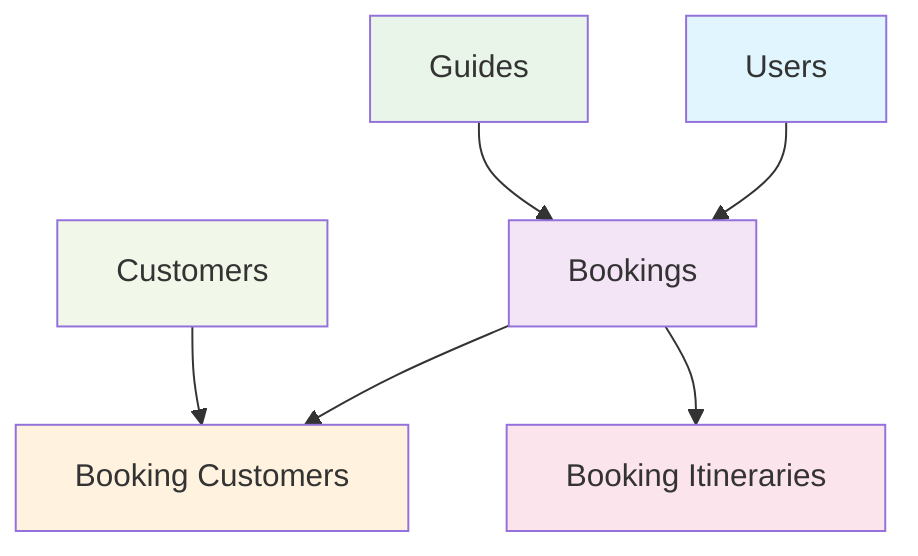

# 🌍 Tour Dashboard

<div align="center">

[](https://laravel.com)
[](https://php.net)
[](https://filamentphp.com)
[](https://livewire.laravel.com)

*A comprehensive tour booking management system built with Laravel and Filament*

[Features](#-features) •
[Installation](#-installation) •
[Usage](#-usage) •
[API](#-api) •
[Contributing](#-contributing)

</div>

---

## ✨ Features

### 🎯 **Tour Management**
- 📅 **Comprehensive Booking System** - Full-featured booking workflow with date management
- 👥 **Customer Management** - Track tour participants and their details
- 🗺️ **Itinerary Planning** - Detailed itinerary management for each booking
- 💰 **Payment Tracking** - Monitor payment status and pricing

### 👤 **Guide Management**
- 🆔 **Guide Profiles** - Complete guide information with identity verification
- 🌐 **Multi-language Support** - Track guide language capabilities
- 📝 **Bio & Experience** - Detailed guide backgrounds and specializations
- 👤 **User Integration** - Seamless user account linking

### 🛡️ **Security & Access Control**
- 🔐 **Role-based Permissions** - Powered by Filament Shield
- 🔑 **User Authentication** - Laravel's robust authentication system
- 🛡️ **Data Protection** - Secure handling of sensitive information

### 📊 **Admin Dashboard**
- 🎨 **Modern UI** - Beautiful Filament admin interface
- 📈 **Real-time Data** - Live updates with Livewire components
- 📱 **Responsive Design** - Works seamlessly on all devices
- ⚡ **Performance Optimized** - Fast and efficient data handling

---

## 🏗️ Architecture



### Core Models
- **🏢 Booking** - Central booking entity linking all components
- **👤 User** - System users with authentication
- **🗺️ Guide** - Tour guides with detailed profiles
- **👥 Customer** - Tour participants
- **🔗 BookingCustomer** - Many-to-many relationship handler
- **📋 BookingItinerary** - Individual itinerary items

---

## 🚀 Installation

### Prerequisites
- PHP 8.2 or higher
- Composer
- Node.js & NPM
- SQLite (for development)

### Quick Start

```bash
# Clone the repository
git clone <repository-url>
cd tour-dashboard

# Install PHP dependencies
composer install

# Install Node dependencies
npm install

# Create environment file
cp .env.example .env

# Generate application key
php artisan key:generate

# Create SQLite database
touch database/database.sqlite

# Run migrations
php artisan migrate

# Install Filament
php artisan filament:install --panels

# Start development server
composer run dev
```

### Development Environment

The `composer run dev` command starts:
- 🌐 Laravel development server
- ⚡ Queue worker
- 📊 Log monitoring (Pail)
- 🎨 Vite asset compilation

---

## 🎮 Usage

### Accessing the Admin Panel

1. Start the development environment:
   ```bash
   composer run dev
   ```

2. Visit `http://localhost:8000/admin`

3. Create an admin user:
   ```bash
   php artisan make:filament-user
   ```

### Managing Tours

#### Creating Bookings
1. Navigate to **Bookings** in the admin panel
2. Click **Create Booking**
3. Fill in booking details:
   - Select guide and user
   - Set dates and number of people
   - Add special requests
4. Assign customers to the booking
5. Create detailed itineraries

#### Guide Management
- Add new guides with complete profiles
- Manage identity verification
- Track language capabilities
- Link to user accounts

### API Integration

The system provides a clean API structure for integration:

```php
// Example: Get booking with relationships
$booking = Booking::with(['user', 'guide', 'customers', 'itineraries'])->find(1);

// Get guide's bookings
$guideBookings = Guide::find(1)->bookings;

// Customer's booking history
$customerBookings = Customer::find(1)->bookings;
```

---

## 🛠️ Development

### Available Commands

```bash
# Development
composer run dev              # Full development environment
php artisan serve            # Laravel server only
npm run dev                  # Vite assets only

# Testing
composer run test            # Run all tests
php artisan test             # Direct test execution

# Database
php artisan migrate          # Run migrations
php artisan migrate:fresh    # Fresh migration
php artisan migrate:status   # Migration status

# Code Quality
./vendor/bin/pint           # Format code
```

### Creating New Resources

```bash
# Create Filament resource
php artisan make:filament-resource ModelName

# Create model with migration
php artisan make:model ModelName -m

# Create factory for testing
php artisan make:factory ModelNameFactory
```

### Testing

The project uses **Pest** for testing with 19+ test files covering:
- Model relationships
- Factory functionality
- API endpoints
- Business logic validation

```bash
# Run specific tests
php artisan test --filter BookingTest

# Run with coverage
php artisan test --coverage
```

---

## 📁 Project Structure

```
├── app/
│   ├── Filament/Resources/     # Admin panel resources
│   │   ├── Bookings/
│   │   ├── Customers/
│   │   ├── Guides/
│   │   └── Users/
│   └── Models/                 # Eloquent models
├── database/
│   ├── factories/              # Model factories
│   ├── migrations/             # Database migrations
│   └── seeders/               # Database seeders
└── tests/                     # Test suite
```

---

## 🤝 Contributing

We welcome contributions! Please follow these guidelines:

1. **Fork** the repository
2. **Create** a feature branch
3. **Write** tests for new features
4. **Follow** Laravel coding standards
5. **Run** `./vendor/bin/pint` for code formatting
6. **Submit** a pull request

### Code Standards
- Follow PSR-12 coding standard
- Write comprehensive tests
- Document new features
- Use semantic commit messages

---

## 📄 License

This project is licensed under the [MIT License](LICENSE).

---

## 🙏 Acknowledgments

Built with amazing technologies:
- [Laravel](https://laravel.com) - The PHP Framework for Web Artisans
- [Filament](https://filamentphp.com) - Beautiful admin panels for Laravel
- [Livewire](https://livewire.laravel.com) - Full-stack framework for Laravel
- [Tailwind CSS](https://tailwindcss.com) - Utility-first CSS framework
- [Pest](https://pestphp.com) - Delightful PHP testing framework

---

<div align="center">
Made with ❤️ for tour operators worldwide
</div>